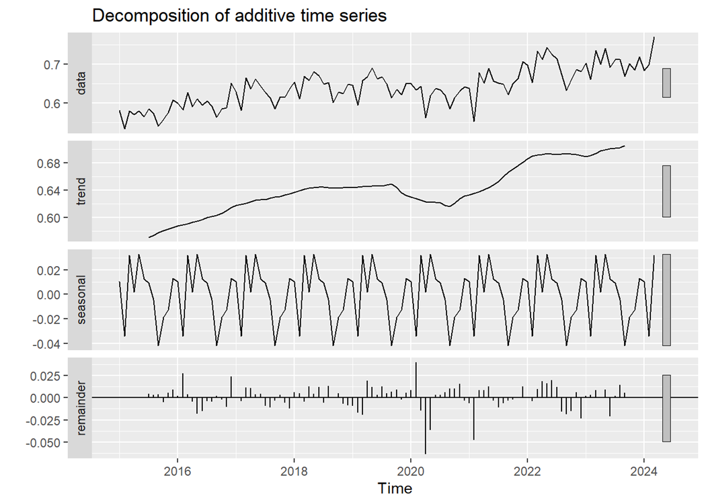

# Forecasting-US-Renewable-Energy-Producition
A TIME SERIES FORECASTING ON U.S. RENEWABLE-ENERGY PRODUCTION 
### Dataset: 
Monthly Energy Review (MER) by U.S. Energy Information Administration

### Overview:
Tracks historical and recent U.S. energy statistics 
Covers production, consumption, stocks, and trade across energy sectors 
Provides insights into the evolving landscape of U.S. energy 

### Focus: 
Total Renewable Energy Production from 1973 to 2024
## Context:
The Paris Agreement and the Glasgow Climate Summit underscore global commitments to reducing carbon emissions and increasing the share of renewable energy. Accurate forecasting of renewable energy trends is crucial for aligning with these international agreements.
## Problem Statement:
How can we predict future renewable energy production trends to ensure compliance with international climate agreements?
### Objectives:
1.	To analyze historical data on U.S. renewable energy production.
2.	To forecast future trends in renewable energy production.
3.	To provide actionable business recommendations that support the goals of the Paris Agreement and the Glasgow Climate Summit.
# Preprocessing Steps
## Visualization of Time Series data

## Window for Analysis

## Decomposition

# Forecasting
## Mean Naive and Seasonal Naive

## ARIMA

## SARIMA

## Exponential Smoothing Forecasting

## Holt Winters Forecasting

## ETS Model

## zzz Model

## Model Evaluation Matrix:

## Prediction using SARIMA for the next 6 Months:

The forecast indicates a gradual decline in renewable energy production over the next six months.This trend necessitates immediate and strategic interventions to enhance production capacity and meet international climate goals.

## Recommendations:
### Investment in Storage Technologies
Storage technologies can mitigate the effects of production dips, ensuring continuous availability and grid stability.

### Forecasted Growth and Potential Constraints
The forecast indicates moderate growth in renewable energy production over the next six months, with potential constraints.
Identifying and addressing these constraints is essential for meeting the international targets.
## Increase share in Renewable energy and reduce dependence in non-renewable sources strategically to ensure smooth shifting in clean energy without any disruptions